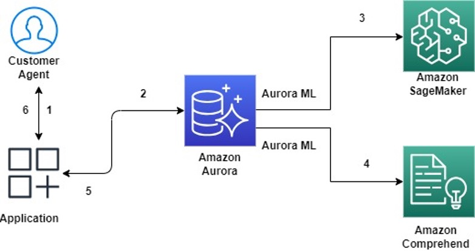

## Text Summarisation using Amazon Aurora and Amazon SageMaker JumpStart

### Use Case

In today's business landscape, the urge to innovate by harnessing the potential of Generative AI (Gen AI) has become palpable. We are truly at an exciting inflection point in the widespread adoption of ML, and we believe every customer experience and application will be reinvented with generative AI. A large percentage of organizational data is still being stored in relational databases. Hence, there is a clear impetus to augment these datasets using Generative AI foundational models to elevate end-user experiences and create novel products.
 
Case summarization is a natural language processing (NLP) task that involves condensing large amounts of text data, such as customer support conversations or service tickets, into concise and meaningful summaries. Customer agents spend considerable time reviewing the case notes before they can service a customer, moreover the wait time is longer when the support case is handed from one agent to the other. In this blog, we discuss how we can assist agents by providing a summary of case notes and identify customer sentiment based on the previous conversations. The proposed solution helps the customer agents to respond faster to customer queries and improve customer experience.

### Architecture

The solution architecture provided below shows the on-demand (real-time) technique for generating a summary of the case notes. Let's explore how each component contributes to the solution.

1. The customer support agent (referred to as user henceforth) wants to view a summary of the incoming support case and also generate a sentiment based on the case notes and the feedback provided by the user. In the frontend application, the user selects or enters the relevant case ID and clicks on “SageMaker JumpStart Summary” button. 
2. The application executes a SQL query on Amazon Aurora which invokes an Aurora ML function by providing the case notes and additional details for the selected case ID stored in Amazon Aurora. 
3. Aurora calls SageMaker endpoint to generate a summary of the case notes using third-party (3P) models in SageMaker Jumpstart. SageMaker uses the AI21 Summarize model to perform case summarization.
4. The user requests a sentiment analaysis. Aurora ML generates the sentiment based on the case notes and feedback by calling Amazon Comprehend. 
5. In Step 5 and 6, Amazon Aurora returns the summarized case information and/or the sentiment analysis as an appropriate response to the user via the frontend application.

### Security

See [CONTRIBUTING](CONTRIBUTING.md#security-issue-notifications) for more information.

### License

This library is licensed under the MIT-0 License. See the LICENSE file.